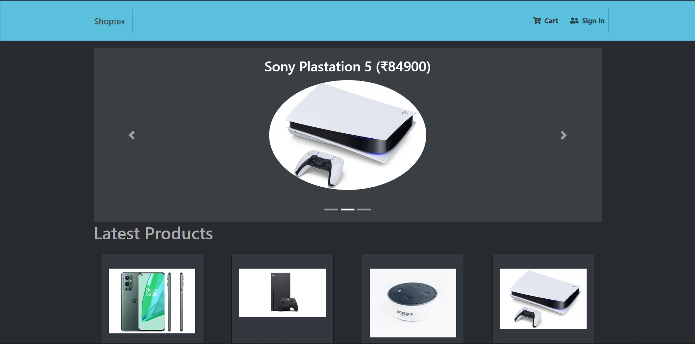
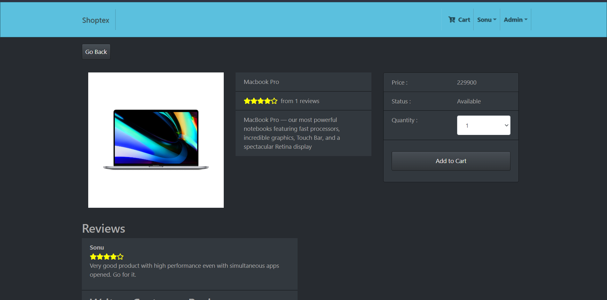
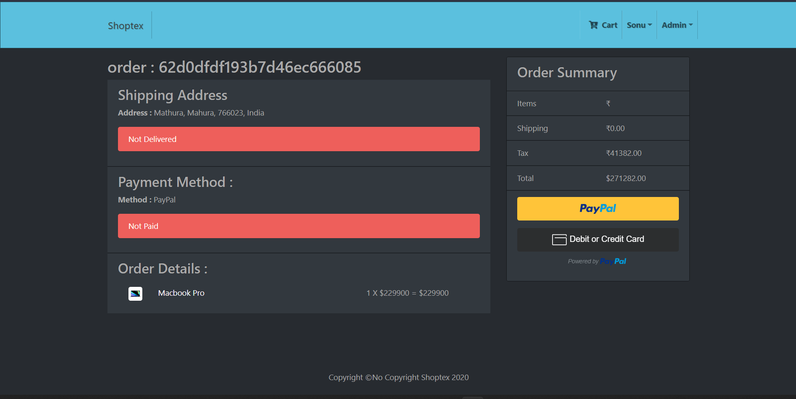

# Shoptex ( E-com web application)

&nbsp;&nbsp;&nbsp;
&nbsp;&nbsp;&nbsp;
&nbsp;&nbsp;&nbsp;
&nbsp;&nbsp;&nbsp;
&nbsp;&nbsp;&nbsp;
&nbsp;&nbsp;&nbsp;

### Live here : [shoptex.herokuapp.com](https://shoptex.herokuapp.com/)

This is an e-commerce web application , a fun personal project built with MERN stack. This application has almost all the features which most of the modern e-com websites have, like cart, payment, authentication, different level of authorization(users, admin) and localstorage support for saving cart info, shipping address info etc.

Play with it by creating an account and complete till the payment.
For payment, use the paypal sandbox account if you have or else you can test with the following :

> email :

> password :

## Features available

-  Authentication(login, logout)
-  Authorization( user and admin)
-  Adding to cart
-  Payment integration( dummy payment )
-  creating product review and rating
-  storing on localstorage if user is not logged in so that he won't lose his info
-  pagination support
-  top rated product to be displayed in the slider
   -  Admin level Access
-  completing payment and delivery shipped
-  adding/removing new product
-  changing the product availability count







## How to get started

```
$ git clone ["git id"]
$ cd e-com-webapp
$ npm install
$ cd frontend
$ npm install
setup the environment variables (listed below)
$ npm run dev
```

### Setup the environment variable

```
create a .env file inside the root folder(e-com-webapp)
JWT_SECRET={your secret key} //can be anything like "abcd1234"
MONGO_URI={your mongodb uri} //see below for seeding basic data into db
NODE_ENV=development
PAYPAL_CLIENT_ID={your paypal sandbox business account client id}//see below for steps to create one
PORT=8080
```

### Seed basic data to test with

```
Create a free mongodb database
Paste your mongo uri in the .env file
Go to backend/data/
Modify the existing users as per your desired email and password
Make sure to put "isAdmin = true" for the first user
Run the "npm run insert" from the root of the project
Check your database, you should see the data reflected there
```

### Paypal client ID setup

```
Go to developer.paypal.com and login to the dashboard
Switch to the sandbox tab
Create a "business account" and a "personal account"
Go to "business account" details and copy the client id to .env file
You can use your "personal account" credential while making test payments
```

## Tech stack used in the project

> -  Javascript
> -  Typescript
> -  React
> -  Redux
> -  Bootstrap
> -  NodeJs
> -  ExpressJs
> -  MongoDB and mongoose
> -  JSON Web Token (JWT)

### Contributions

Feel free to contribute . Open an issue if you found one or give a Pull request

##### Made By : [Pratyush Ranjan](pratyush.work)
